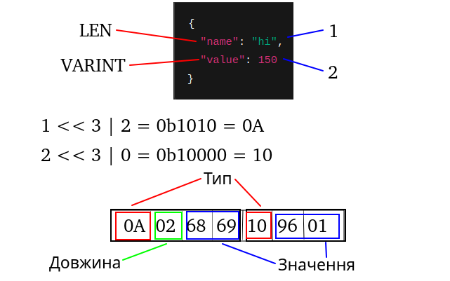
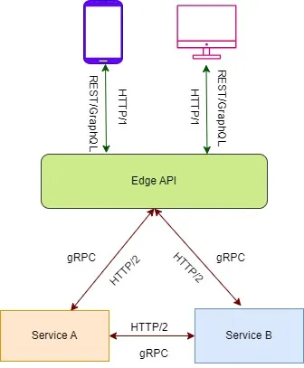

# gRPC 

- [Загальні поняття](#загальні-поняття)
  - [RPC](#rpc)
  - [HTTP/2](#http2)
  - [gRPC](#grpc-1)
  - [Використання gRPC](#використання-grpc)
- [Архітектура gRPC](#архітектура-grpc)
  - [Загальне про архітектуру](#загальне-про-архітектуру)
  - [Protobuf під капотом](#protobuf-під-капотом)
  - [Механізм виклику сервісів](#механізм-виклику-сервісів)
  - [Канали та з'єднання](#канали-та-зєднання)
  - [Обробка помилок та ретраї](#обробка-помилок-та-ретраї)
  - [Безпека в gRPC](#безпека-в-grpc)
  - [Типова система з використанням gRPC](#типова-система-з-використанням-grpc)
- [Додаток](#додаток)
  - [User service](#user-service)
  - [Message service](#message-service)
  - [Chat service](#chat-service)
  - [Запуск додатка](#запуск-додатка)
  - [Використання](#використання)
- [Цікаві відомості](#цікаві-відомості)
- [Цікаві посилання](#корисні-посилання)
# Загальні поняття

### RPC
RPC (Remote procedure call) - протокол, що дозволяє програмі, запущеній на одному комп'ютері, звертатись до функцій (процедур) програми, що виконується на іншому комп'ютері, подібно до того, як програма звертається до власних локальних функцій. 

RPC працює за принципом протоколів "запит-відповідь" . Виклик ініціюється клієнтом, що надсилає повідомлення віддаленого сервера з запитом щодо виконання заданої процедури з деякими параметрами. Віддалений сервер надсилає відповідь до клієнта і додаток продовжує процесс, що обробляє відповідь. Поки сервер оброблює відповідь, клієнт заблокований (він чекає поки сервер завершить свій процес, перед тим як відновити виконання своєї задачі), якщо тільки не викликається асинхронний запит з клієнта.


### Послідовність подій

1. Клієнт викликає клієнтську заглушку. Робиться виклик локальної процедури, під час якої параметри записується у стек.
2. Заглушка (stub) клієнта готує виклик шляхом упаковки параметрів до виклику процедури. (Цей процес називається маршалінгом)
3. Локальна операційна система клієнта надсилає повідомлення з клієнтської машини до сервера.
3. Локальна операційна система сервера передає прийняті пакети до стабу сервера.
4. Стаб сервера розпаковує параметри з повідомлення (Цей процес називається демаршалінгом).
5. Наприкінці, серверний стаб викликає процедуру на сервері. Відповідь формується та надсилається за цією ж послідовністю, але у зворотньому напрямку.

### HTTP/2

HTTP/2 — це друга основна версія протоколу HTTP, яка була офіційно затверджена в 2015 році [RFC 9113](https://www.rfc-editor.org/rfc/rfc9113). Вона значно покращує продуктивність порівняно з HTTP/1.1, особливо у швидкості завантаження веб-сторінок та ефективності використання мережевих ресурсів.

Особливості HTTP/2:

**Мультиплексування**

HTTP/2 дозволяє передавати кілька запитів та відповідей одночасно по одному TCP-з'єднанню. Це частково усуває проблему блокування запитів у HTTP/1.1 (Head-of-line blocking).


**Бінарний протокол**

HTTP/2 використовує бінарний формат замість текстового (як у HTTP/1.1), що зменшує накладні витрати на парсинг і покращує ефективність передачі даних.


**Стиск заголовків (HPACK)**

HTTP/2 стискає HTTP-заголовки за допомогою спеціального алгоритму HPACK, що значно зменшує обсяг переданої інформації.


**Server Push**

Сервер може відправляти ресурси клієнту ще до того, як клієнт їх запросив. Це допомагає зменшити затримки у завантаженні сторінки.


**Пріоритизація запитів**

HTTP/2 дозволяє вказувати пріоритетність запитів, що допомагає оптимізувати порядок їхньої обробки.


**Одне з'єднання на домен**

На відміну від HTTP/1.1, який відкривав кілька TCP-з'єднань для паралельних запитів, HTTP/2 використовує лише одне з'єднання на домен, що зменшує накладні витрати на встановлення з'єднань.


### gRPC

gRPC (Google Remote Procedure Call) - це система віддаленого виклику процедур (RPC) з відкритим кодом, початково розроблена в Google у 2015 році як наступне покоління інфраструктури RPC Stubby. 

**Особливості gRPC**

gRPC використовує HTTP/2 як транспортний протокол. HTTP/2 забезпечує більш ефективне використання мережевих ресурсів у порівнянні з HTTP/1.1, дозволяючи безлічі запитів та відповідей передаватися паралельно в рамках одного TCP-з'єднання. Це зменшує затримки та збільшує загальну продуктивність.

gRPC використовує Protocol Buffers, мову опису інтерфейсів та систему серіалізації від Google, як формат для структурування даних. ProtoBuf дозволяє визначати структуру даних та інтерфейси сервісів у спеціальних файлах `.proto`. Ці файли компактні, ефективні та дозволяють автоматично генерувати вихідний код для різних мов програмування.

ProtoBuf серіалізує структуровані дані у менший обсяг у порівнянні з такими форматами, як JSON або XML. Це зменшує розміри пакетів даних, прискорюючи їх передачу та обробку. Про ProtoBuf докладніше трохи пізніше.

Приклад `.proto` файлу
```proto
// Визначення версії синтаксиса ProtoBuf
syntax = "proto3";

// Визначення повідомлення User
message User {
  int32 id = 1;
  string name = 2;
  string email = 3;
  repeated string roles = 4;
}

// Визначення запиту для отримання інформації про користувача
message GetUserRequest {
  int32 user_id = 1;
}

// Визначення відповіді, що містить інформацію про користувача
message GetUserResponse {
  User user = 1;
}

// Визначення сервіса ChatServiceImpl
service ChatServiceImpl {
  // Визначення метода для отримання інформації про користувача
  rpc GetUser (GetUserRequest) returns (GetUserResponse);
}
```

gRPC підтримує кілька типів взаємодій:

- **Unary RPC**: Це базова і проста модель в gRPC. Клієнт відправляє один запит серверу та отримує у відповідь одне повідомлення. Це аналогічно до традиційного виклику функції в програмуванні. Підходить для простих запитів та операцій, де потрібна одноразова взаємодія, наприклад, отримання інформації щодо ідентифікатора або надсилання даних для обробки.

- **Server streaming RPC**: У цій моделі клієнт надсилає один запит серверу, після чого сервер починає надсилати потік відповідей. Клієнт читає відповіді з їх надходження, що може тривати невизначений час. Дуже добре підходить для сценаріїв, де сервер повинен надіслати велику кількість даних або постійно оновлювану інформацію, наприклад, при передачі логів або потокової передачі даних.

- **Client streaming RPC**: У цій моделі клієнт надсилає потік даних серверу. Після завершення відправки потоку клієнт чекає на відповідь від сервера. Сервер обробляє весь потік даних, перш ніж надіслати одну відповідь. Цей тип підходить для сценаріїв, де клієнту необхідно надіслати велику кількість даних або серію повідомлень, наприклад, під час завантаження великих файлів або пакетної обробки даних.

- **Bidirectional streaming RPC**: У двонаправленому потоковому RPC клієнт та сервер обмінюються потоками даних в обох напрямках. Клієнт може розпочати відправлення серії повідомлень, не чекаючи відповіді сервера, і навпаки. Цей тип RPC найбільш гнучкий і підходить для складних взаємодій, де клієнт та сервер повинні активно обмінюватися даними в реальному часі, наприклад, в інтерактивних програмах, чатах або системах реального часу.

**Канал в gRPC**

Канал gRPC забезпечує підключення до сервера gRPC на вказаному хості та порту. Використовується при створенні заглушки клієнта. Клієнти можуть вказати аргументи каналу, щоб змінити поведінку gRPC за замовчуванням, наприклад увімкнути або вимкнути стиснення повідомлень. Канал має стан, `connected` та `idle`.

**Deadlines/Timeouts**

gRPC дозволяє клієнтам вказати, як довго вони готові чекати завершення RPC, перш ніж RPC завершиться з помилкою DEADLINE_EXCEEDED. На стороні сервера сервер може запитувати, чи минув час очікування певного RPC або скільки часу залишилося для завершення RPC.

### Використання gRPC

**Мікросервісна архітектура**

gRPC ідеально підходить для побудови мікросервісів, де необхідна ефективна комунікація між сервісами. Використовується для реалізації сервісів, які працюють на різних мовах програмування (наприклад, один сервіс на Go, інший на Python).

**Високонавантажені системи**

Завдяки використанню HTTP/2, gRPC забезпечує високу продуктивність і низьку затримку, що робить його ідеальним для систем з великою кількістю запитів (наприклад, фінансові системи, IoT, ігрові сервери).

**Реальний час (Real-time systems)**

gRPC підтримує двонаправлену потокову передачу даних, що дозволяє реалізовувати системи реального часу, такі як чати, онлайн-ігри або системи моніторингу.

**Мережі з низькою пропускною здатністю**

Повідомлення gRPC серіалізуються за допомогою Protobuf, легкого формату повідомлень. Повідомлення gRPC завжди менше, ніж еквівалентне повідомлення JSON.

# Архітектура gRPC

### Загальне про архітектуру

**gRPC = HTTP/2 + Protocol Buffers** 

Аріхтекутра gRPC являє собою комбінацію швидкості `HTTP/2` та серіалізатора `protobuff`. Цей підхід дозволяє будувати розподілені системи з максимальною ефективністю обробки запитів і виступає мостом між заглушкою (stub), або клієнтом, та сервером. Клієнт викликає методи через спеціальну заглушку (stub), яка автоматично генерується з файлу .proto. Ця заглушка приховує всю складність: вона серіалізує дані у двійковий формат за допомогою Protocol Buffers, надсилає їх через HTTP/2 і чекає відповіді. На сервері інша заглушка приймає запит, розпаковує його й передає до потрібного методу. Відповідь іде тим самим шляхом назад. Усе це відбувається настільки швидко, що здається магією, але за цією магією стоять добре продумані компоненти.


Основна перевага архітектури gRPC — це її орієнтація на продуктивність і гнучкість. Завдяки HTTP/2 з його мультиплексуванням і стисненням заголовків, а також Protobuf із компактним бінарним форматом, системи з використанням gRPC можуть обробляти мільйони запитів на день.

### Protobuf під капотом

Коли ви створюєте .proto-файл, наприклад, із визначенням сервісу та повідомлень, компілятор protoc генерує код для вашої мови програмування. Цей код завантажує схему в пам’ять під час виконання і використовує її для перетворення даних у бінарний формат.


Для серіалізації в бінарний формат protobuf використовує формат TLV(Tag - Length - Value). 
Для кожного типу даних використовуються свій тег(ключ)

| ID  | Name   | Used For                                                  |
|---- |--------|-----------------------------------------------------------|
| 0   | VARINT | int32, int64, uint32, uint64, sint32, sint64, bool, enum  |
| 1   | I64    | fixed64, sfixed64, double                                 |
| 2   | LEN    | string, bytes, embedded messages, packed repeated fields  |
| 3   | SGROUP | group start (deprecated)                                  |
| 4   | EGROUP | group end (deprecated)                                    |
| 5   | I32    | fixed32, sfixed32, float                                  |

Процес серіалізації виглядає так: для кожного поля обчислюється тег (комбінація номера поля та wire type), потім додається значення, закодоване відповідно до типу даних. Для рядків спочатку записується довжина (теж у Varints), а потім символи в UTF-8. Повідомлення завершується нульовим тегом, який сигналізує його кінець. На іншому кінці той самий .proto-файл використовується для розшифровки цього потоку байтів у структуровані дані.




### Механізм виклику сервісів

Виклик сервісів починається з .proto-файлу, де визначено сервіс і його методи. Клієнт викликає метод через стаб, передаючи структурований запит. Стаб перетворює цей запит у бінарний формат через Protobuf і надсилає його по HTTP/2-з’єднанню. На сервері запит потрапляє до скелета, який розпаковує дані та передає їх у реалізацію методу. Результат повертається назад тим самим шляхом.

Усі запити в gRPC передаються з методом HTTP POST та містять заголовок `Content-Type: application/grpc`. Також можуть бути інші заголовки, такі як шлях (наприклад, /ChatServiceImpl/GetUser), час очікування (grpc-timeout) і, якщо треба, додаткові метадані.

На сервері gRPC- бібліотека отримує цей запит через HTTP/2-з’єднання. Вона аналізує заголовки, визначає потрібний сервіс і метод, а потім передає десеріалізоване повідомлення серверному стабу. Сервер виконує логіку методу і повертає відповідь, яка знову серіалізується і відправляється клієнту через той же канал HTTP/2. Цей процес підтримує як одноразові (unary) виклики, так і потокові моделі, про які ми говорили раніше.
Ключова особливість — мультиплексування HTTP/2. Завдяки потокам (streams) у межах одного TCP-з’єднання, gRPC може одночасно обробляти кілька викликів без блокування. Кожен потік має унікальний ідентифікатор, а повідомлення розбиваються на фрейми (DATA для даних, HEADERS для метаданих), які переплітаються і збираються на іншому кінці. Це усуває проблему "head-of-line blocking", характерну для HTTP/1.1, і забезпечує високу пропускну здатність.


### Канали та з'єднання

Канали в gRPC — це абстракція над HTTP/2-з’єднанням, яка забезпечує зв’язок між клієнтом і сервером. Коли ви створюєте канал, ви вказуєте адресу сервера (наприклад, localhost:5000) і додаткові налаштування, як-от стиснення чи автентифікація.
Канал має стани, такі як connected (активний) або idle (очікування запитів).


Під капотом канал спирається на TCP-з’єднання, яке встановлюється через триетапний handshake (SYN, SYN-ACK, ACK). Але після встановлення gRPC повторно використовує це з’єднання, уникаючи витрат на нові підключення. Якщо з’єднання обривається, канал може автоматично перепідключитися — це робить систему стійкою до збоїв. У реальних системах, де тисячі клієнтів стукають до сервера, канали допомагають уникнути перевантаження мережі.
Ви можете налаштувати канал, наприклад, увімкнути стиснення повідомлень або встановити таймаути.


### Обробка помилок та ретраї


У gRPC статуси відповіді використовуються для повідомлення клієнта про результати виконання виклику RPC. Вони містять код статусу, повідомлення та додаткові метадані.

| Код | Назва                 | Опис |
|-----|------------------------|------------------------------------------------------------|
| 0   | OK                     | Виклик виконаний успішно. |
| 1   | CANCELLED              | Виклик був скасований (клієнтом або сервером). |
| 2   | UNKNOWN                | Невідома помилка (наприклад, виняток на сервері без деталізації). |
| 3   | INVALID_ARGUMENT       | Передані невірні аргументи. |
| 4   | DEADLINE_EXCEEDED      | Час виконання запиту перевищений. |
| 5   | NOT_FOUND              | Запитаний ресурс не знайдено. |
| 6   | ALREADY_EXISTS         | Об'єкт вже існує. |
| 7   | PERMISSION_DENIED      | Немає прав для виконання операції. |
| 8   | RESOURCE_EXHAUSTED     | Перевищено ліміт ресурсів (наприклад, кількість запитів). |
| 9   | FAILED_PRECONDITION    | Операція неможлива у поточному стані. |
| 10  | ABORTED                | Конфлікт або перерваний запит (наприклад, через блокування). |
| 11  | OUT_OF_RANGE           | Запитане значення виходить за допустимі межі. |
| 12  | UNIMPLEMENTED         | Викликана неіснуюча або не реалізована функція. |
| 13  | INTERNAL               | Внутрішня помилка сервера. |
| 14  | UNAVAILABLE            | Сервер тимчасово недоступний. |
| 15  | DATA_LOSS              | Втрата або пошкодження даних. |
| 16  | UNAUTHENTICATED        | Відсутня або недійсна автентифікація. |

Коли RPC-виклик завершується з помилкою, сервер повертає статусний код, наприклад, UNAVAILABLE (сервіс тимчасово недоступний) або DEADLINE_EXCEEDED (перевищено час очікування). Клієнтська бібліотека gRPC дивиться на ці коди й вирішує, чи варто повторити спробу.

За замовчуванням ретраї не активні, але клієнт може налаштувати політику ретраїв, визначивши максимальну кількість спроб, початкову затримку, максимальну затримку, множник затримки та коди, які варто повторювати. Наприклад, якщо сервер повертає UNAVAILABLE, клієнт може чекати 0.1 секунди (з випадковими відхиленнями ±20%, щоб уникнути одночасних запитів), потім повторити запит. Затримка зростає експоненціально (наприклад, 0.1 с, 0.2 с, 0.4 с), але не перевищує максимум, скажімо, 1 секунду. Це називається експоненціальним відступом (exponential backoff) і запобігає перевантаженню сервера.

Приклад налаштування:
```json
"retryPolicy": {
  "maxAttempts": 4,
  "initialBackoff": "0.1s",
  "maxBackoff": "1s",
  "backoffMultiplier": 2,
  "retryableStatusCodes": ["UNAVAILABLE"]
}
```


Коли клієнт GRPC більше не зацікавлений у результаті виклику RPC, він може скасувати запит до серверу. Коли RPC скасовується, сервер повинен припинити будь-які поточні обчислення та закінчити його сторону потоку.


Найчастішою причиною відкликання запиту є помилки, а також deadline (timeout) - перевищений час очікування відповіді. 
За замовчуванням gRPC не встановлює deadline, що означає, що клієнт може очікувати на відповідь вічність. Щоб уникнути цього, ви завжди повинні встановлювати реалістичні deadline у своїх клієнтів.
Також сервер може отримувати RPC від клієнта з нереально коротким терміном, який не дасть серверу достатньо часу, щоб коли-небудь відповісти вчасно. Це призведе до того, що сервер просто витратить цінні ресурси та, в найгіршому випадку, взагалі ляже. Сервер GRPC займається цією ситуацією автоматично, скасовуючи запит (статус CANCELED), коли термін, встановлений клієнтом, пройшов.

Приклад налаштування:
```java
// Дедлайн в синхронних стабах
MyServiceGrpc.MyServiceBlockingStub stub = MyServiceGrpc.newBlockingStub(channel)
    .withDeadlineAfter(3, TimeUnit.SECONDS);

// Дедлайн в асинхронних стабах
MyServiceGrpc.MyServiceStub asyncStub = MyServiceGrpc.newStub(channel)
    .withDeadline(Deadline.after(3, TimeUnit.SECONDS));
```


### Безпека в gRPC

Безпека в gRPC реалізована через SSL/TLS, який шифрує дані між клієнтом і сервером. Це стандартний підхід для захисту конфіденційності та цілісності інформації, активований за замовчуванням при використанні https. Наприклад, канал може бути налаштований як GrpcChannel.ForAddress("https://example.com:5001"). Шифрування забезпечує, що дані не будуть перехоплені чи змінені під час передачі.
Крім того, gRPC підтримує автентифікацію. Клієнт може надсилати токени (наприклад, OAuth) у метаданих запиту — спеціальному наборі ключ-значення, який передається разом із HTTP/2-заголовками. Сервер перевіряє ці токени, щоб переконатися, що запит надійшов від авторизованого користувача. Це дозволяє гнучко реалізовувати різні сценарії, як-от контроль доступу за ролями чи перевірку сертифікатів клієнта. Такий підхід робить gRPC безпечним вибором для внутрішньої комунікації між мікросервісами, де захист даних важливий, але продуктивність не повинна страждати.
Стиснення заголовків HPACK у HTTP/2 також підвищує безпеку, зменшуючи розмір метаданих і ускладнюючи аналіз трафіку. Усе це разом робить gRPC надійним вибором для внутрішньої комунікації в мікросервісах, де конфіденційність і цілісність даних критично важливі.


### Типова система з використанням gRPC

Типова схема розподіленої системи виглядає наступним чином:




Бекенд з використанням gRPC працює виключно по HTTP/2, кожен сервіс повинен мати свій .proto файл, який є контрактом та гарантією інтеграції сервісів. Крім того, якщо сервіс викликає інші сервіси, то він повинен мати доступ до їх контракту. Це може бути звичайна локальна копія, віддалений репозиторій, який зберігає контракти, або генерувати клієнти через api-gateway.

Компілятор генерує заглушки, і розробники реалізовують логіку. Якщо сервіс продуктів тимчасово падає, gRPC із увімкненими ретраями спробує повторити запит, не змушуючи клієнта чекати вічно. А TLS шифрує весь трафік, щоб ніхто не вкрав дані платежів.

Таким чином, спілкування сервісів вимагає лише доступ до .proto файлу, а решта налаштувань працює ідентично будь-якій іншій системі: може використовувати naming сервери, api gateway, прямий виклик клієнтів і тд.

Для спілкування кожен сервіс може бути лише сервером, лише клієнтом, або ж і приймати, і надсилати запити. В залежності від потреб в сервісі створюються необхідні заглушки.

Враховуючи особливості HTTP/2 та великою кількістю систем на HTTP/1.1 нерідким є варіант створення api gateway, який приймає запит по HTTP/1.1 та використовується, наприклад, фронтендом.

Сервіси  gRPC при високих навантаженнях можуть працювати без заркриття каналу, і витримувати до декількох запитів на добу. У реальному прикладі в компаніїї Sendinblue система з 7 мільйонами запитів на день показала нульовий відсоток помилок із gRPC, що доводить його ефективність у порівнянні з традиційними брокерами повідомлень.

# Додаток

Для демонстрації роботи з gRPC був створений додаток. Додаток уявляє собою чат де користувачі обмінюються повідомленнямми в реальному часі.
Користувач створює групу, до якої під'єднуються інші користувачі. Він відправляє повідомлення в групу, яке автоматично 
відправляється всім користувачам.


В даному додатку було реалізовано три сервіси, які спілкуються між собою:

### User service
Сервіс, який відповідає за управління користувача. В ньому користувач може створити, 
видалити обліковий запис та взяти інформацію з профілю. Сервіс може викликатись як кінцевим коритувачем так і внутрішнім сервісом.

Він має в собі 3 RPC методи:
```protobuf
service UserService {
  rpc CreateUser (CreateUserRequest) returns (CreateUserResponse) {};
  rpc GetUser (GetUserRequest) returns (GetUserResponse) {};
  rpc DeleteUser (DeleteUserRequest) returns (DeleteUserResponse) {};
}
```
Детально protobuf схему можна подивитись [тут](shared/user.proto).

### Message Service
Сервіс, який виступає проміжною ланкою між користувачем та отриманням йому повідомленнями. Користувач може почати слухати канал, і йому почнуть приїодити повідомлення з його груп,
також користувач може надіслати своє повідомлення в певну групу і тоді, це повідомлення отримає решта учасників. Це перенаправлення відбувається завдяки тому, що сервіс зберігає за яким каналом закріплений користувач і, отримавши список користувачів від Chat сервісу, направляє туди повідомлення.
Цей сервіс також надсилає запити до User сервісу, щоб отримати певні дані користувача, наприклад, ім'я.

Він має в собі 1 RPC метод:
```protobuf
service MessageService {
    rpc messageStream (stream MessageRequest) returns (stream MessageResponse) {};
}
```
Детально protobuf схему можна подивитись [тут](shared/message.proto).


### Chat Service
Цей сервіс відповідає за управління групами. Виконуються як базові CRUD-операції, так і перенаправлення повідомлення усім учасникам чату.
Користувач може створити чат, записатися в нього, вийти з чату, подивитися користувачів чату. Chat сервіс надсилає Message сервісу потік повідомлень для передачі повідомлення усім учасникам групи.

Він має в собі 5 RPC методів:
```protobuf
service ChatService {
  rpc createChat (CreateChatRequest) returns (CreateChatResponse) {};
  rpc joinChat(JoinChatRequest) returns (JoinChatResponse) {};
  rpc leaveChat(LeaveChatRequest) returns (LeaveChatResponse) {};
  rpc getMembers(GetMembersRequest) returns (GetMembersResponse) {};
  rpc shareMessage (stream SharedMessageRequest) returns (stream ShareMessageResponse) {};
}
```

Детально protobuf схему можна подивитись [тут](shared/chat.proto).

Діаграма використання для обміну повідомленнями між користувачами:


### Запуск додатка
1. Для того щоб запустити застосунок необхідно використати Docker та Docker Compose:
   - Встановити Docker можна [тут](https://www.docker.com/products/docker-desktop/)
   - Встановити Docker Compose можна [тут](https://docs.docker.com/compose/install/)
2. Скопіюйте репозиторій
  ```sh
  git clone https://github.com/andyflight/grpc-example
  cd grpc-example
  ```
3. Запустіть Docker Compose
  ```sh
  docker compose up
  ```
### Використання
Використовуючи Postman або подібні клієнти, можна або завантажити усі `.proto` файли, 
які знаходяться в папці [shared](shared), або використати server reflection, який автоматично завантажить схеми.


Використовуючи завантажені схеми, ми можемо викликати різні методи та дивитись роботу сервісів.

# Цікаві відомості

### REST vs GraphQL vs gRPC
REST, GraphQL та gRPC дозволяють різним компонентам програми спілкуватися один з одним через мережу. 

#### REST оптимально використовувати у ситуаціях, коли потрібно:
- Надавати дані та послуги через API. Зараз REST — найпопулярніший і найзручніший підхід до створення API, які призначені для максимально простого використання іншими додатками та службами.
- Підтримувати безліч платформ та мов програмування. REST спирається на стандартні методи HTTP та формати даних, його можна використовувати з широким спектром мов програмування та платформ.
- Підтримувати кешування, яке може покращити продуктивність та знизити мережевий трафік.
- Створити простий та легковажний API для нескладної програми.
- Коли потрібно підтримувати велику кількість ресурсів.

Однак REST – не найкращий вибір для API, які:
- Вимагають оновлення у реальному часі.
- Виконують складні запити та маніпуляції з даними.

У таких випадках краще використовувати GraphQL або gRPC.

#### GraphQL буде оптимальним вибором у ситуаціях, коли:
- Потрібно скоротити мережевий трафік - GraphQL дозволяє клієнтам вказувати точно, які дані їм потрібні, що зменшує передачу непотрібної інформації.
- Необхідно підтримувати широкий спектр клієнтів — GraphQL підтримує типізовані запити, які можна використовуватиме забезпечення отримання клієнтами коректних даних у зрозумілому їм форматі.
- Потрібна підтримка оновлень в реальному часі GraphQL підтримує оновлення в реальному часі через підписки, які дозволяють клієнтам отримувати оновлення відразу ж, як тільки вони стають доступними.
- Потрібна підтримка складних запитів та маніпуляцій з даними GraphQL дозволяє клієнтам виконувати складні запити та операції з даними (фільтрація, сортування та агрегація) з простим синтаксисом.
- Необхідна підтримка версіонування — GraphQL дозволяє клієнтам вказувати версію схеми у своїх запитах, що полегшує підтримку зворотної сумісності у міру розвитку схеми.

Недолік GraphQL один – він може вимагати більше часу на налаштування та конфігурацію в порівнянні з RESTful API, особливо якщо ви працюєте з кількома мовами програмування або платформами.

#### gRPC стане оптимальним вибором, коли потрібно:

- Висока продуктивність та ефективність – gRPC використовує бінарний протокол, підтримує двонаправлену потокову передачу та управління потоком, що робить його набагато швидшим та ефективнішим за інші API, особливо в умовах високої затримки або низької пропускної здатності.
- Підтримка широкого спектру мов програмування – gRPC підтримує багато мов, включаючи Java, C++, Python та Go, що полегшує побудову розподілених систем на різних платформах.
- Підтримка оновлень у реальному часі – двонаправлена ​​потокова передача дозволяє серверам надсилати оновлення клієнтам у реальному часі.
- Обробка великих обсягів даних – власний формат Protocol Buffers ефективніший і компактніший у порівнянні з JSON та XML.
- Використання мікросервісів або розподілених систем – gRPC надає потужну та гнучку платформу для створення масштабованих мікросервісів та розподілених систем, здатних справлятися з великими обсягами трафіку.

Недоліки gRPC – відносна складність для розробників-початківців, неможливість безпосередньо викликати службу gRPC з браузера, нечитані (без спеціальних інструментів десеріалізації) повідомлення.

Порівнюючи ці три підходи, цікаво також наглядно побачити на скільки сильно вони відрізняються в плані продуктивності.
Ці два графіки показують реальну пропускну здатність сервісів, при використанні цих трьох підходів:

Кількість запитів за секунду


Час очікування відповіді


### JSON vs ProtoBuf

JSON і ProtoBuf є широко використовуваними форматами серіалізації даних, але вони служать різним цілям і мають різні характеристики. 

#### Структура та дизайн
   - JSON - зрозумілий текстовий формат, який представляє дані як пари ключ-значення, масиви та вкладені об’єкти. Він легкий і не залежить від мови, але покладається на розбір рядків.
   - ProtoBuf: двійковий формат серіалізації, розроблений Google. Він використовує схему (визначену у файлах .proto) для кодування даних у компактну двійкову форму, що усуває потребу в аналізі тексту.

#### Швидкість серіалізації/десеріалізації
- JSON:
  - Повільніше: серіалізація передбачає перетворення даних у текстовий рядок, а десеріалізація вимагає розбору цього рядка назад в об’єкт. 
  Цей процес є дорогим з точки зору обчислень, особливо для великих наборів даних, через маніпуляції з рядками та кодування/декодування UTF-8.
  - Продуктивність значною мірою залежить від бібліотеки JSON (наприклад, json Python проти швидших альтернатив, таких як ujson).
- ProtoBuf:
  - Швидше: серіалізація перетворює дані безпосередньо в компактний двійковий формат на основі попередньо визначеної схеми, уникаючи накладного тексту. Десеріалізація також є швидшою, оскільки вона зчитує двійкові дані безпосередньо в пам’ять без аналізу рядків.
  - Тести тестування часто показують, що ProtoBuf у 5-10 разів швидший за JSON для серіалізації/десеріалізації, залежно від розміру та складності даних.

#### Ефективність розміру
- JSON: більший розмір на диску або через мережевий зв’язок через його текстову природу та включення назв полів у вивід (наприклад, `{"ім’я": "Іван"}`).
- ProtoBuf: набагато менший, тому що він використовує двійковий формат і призначає числові теги полям (визначеним у схемі) замість повторюваних назв полів.

# Корисні посилання
- [Офіційний сайт gRPC](https://grpc.io/)
- [Стаття про gRPC Хабр](https://habr.com/ru/companies/otus/articles/780720/)
- [HTTP/2 корисна стаття](https://vps.ua/blog/protocol-http-2-benefits/)
- [Детальний розбір HTTP/2 Хабр](https://habr.com/ru/companies/timeweb/articles/751338/)
- [HTTP/1 vs HTTP/2 vs HTTP/3](https://www.youtube.com/watch?v=UMwQjFzTQXw)
- [gRPC Roadmap](https://roadmap.sh/ai/grpc-learning-path-9ytqz)
- [Додаткові приклади використання gRPC](https://github.com/GoogleCloudPlatform/microservices-demo)